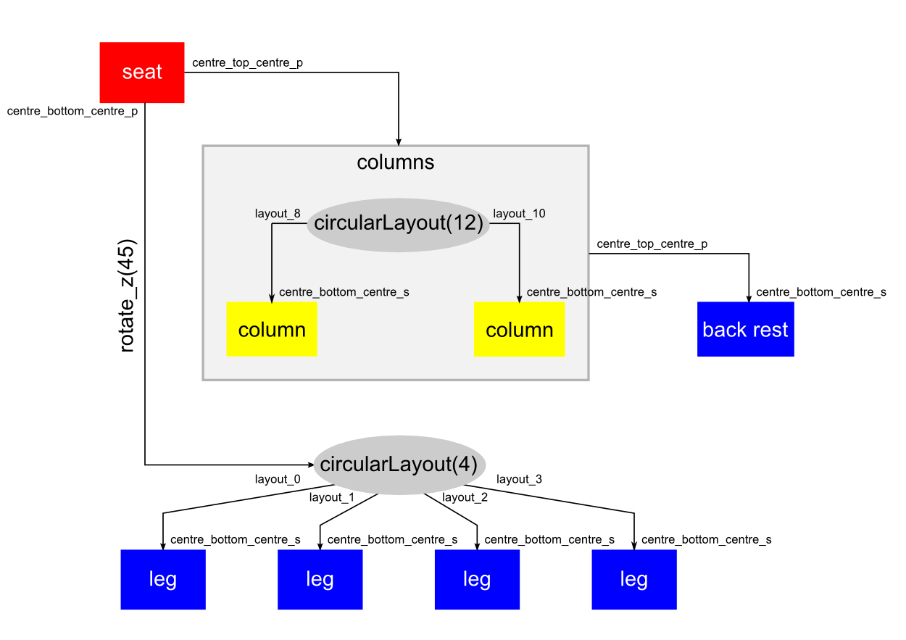

# Model generation {#model_generation}

The 3D models used to represent reward objects in DeepMind Lab are specified via
the `model` member in the table returned by the _createPickup_ method of the
level API:

```lua
local api = {}

function api:createPickup(classname)
  return {
      name = 'Apple',
      classname = 'apple_reward',
      model = 'models/apple.md3',
      quantity = 1,
      type = pickups.type.REWARD
  }
end

return api
```

In most cases, the `model` string references the file containing the 3D model
data in a native _Quake III Arena_ file format, such as MD3. These models must
be created in a Digital Content Creator tool such as Blender, and the exported
model files must be included in any of the `.pk3` files deployed alongside
DeepMind Lab.

The asset pipeline just described precludes programmatic generation of 3D
models. This functionality would be desirable in order to create environments
where agents are presented with randomly generated reward objects. For instance,
an environment where agents are expected to recognise objects in the shape of a
chair with varying properties such as the shape of the backrest or the number of
legs.

Whenever the runtime cannot resolve the asset referenced by `model`, it will
invoke the _createModel_ method of the level API with the contents of that
string. This allows defining 3D Models dynamically from Lua, using a low level
description consisting of a collection of polygonal surfaces. These polygonal
surfaces are Lua tables with the following members:

*   `vertices`: a 2D FloatTensor with rows of vertex data, each with 8
    components - 3 position coordinates, 3 normal coordinates and 2 texture
    coordinates
*   `indices`: a 2D Int32Tensor with rows of index data, each with 3
    components - the vertex indices for each triangular face
*   `shaderName`: the shader used to render the surface

In addition, a model can also define a set of 3D frames of reference, called
'locators', which identify notable points and are used to combine several models
together. These frames are expressed as homogeneous 3D transformation matrices
(4x4), stored in column-major order.

In the example below, the level API defines a unit cube for a custom reward
object, with a single locator pointing upwards from the centre of its top face:

```lua
local api = {}

function api:createPickup(classname)
  return {
      name = 'Custom cube',
      classname = 'custom_cube',
      model = 'customCubeModel',
      quantity = 1,
      type = pickups.type.REWARD
  }
end

local kCustomModels = {
    customCubeModel = {
        surfaces = {
            cubeSurface = {
                vertices = tensor.FloatTensor{
                    { -0.5, -0.5, -0.5,  0.0,  0.0, -1.0, 0.0, 0.0 },
                    {  0.5, -0.5, -0.5,  0.0,  0.0, -1.0, 1.0, 0.0 },
                    {  0.5,  0.5, -0.5,  0.0,  0.0, -1.0, 1.0, 1.0 },
                    { -0.5,  0.5, -0.5,  0.0,  0.0, -1.0, 0.0, 1.0 },
                    {  0.5, -0.5, -0.5,  1.0,  0.0,  0.0, 0.0, 0.0 },
                    {  0.5, -0.5,  0.5,  1.0,  0.0,  0.0, 1.0, 0.0 },
                    {  0.5,  0.5,  0.5,  1.0,  0.0,  0.0, 1.0, 1.0 },
                    {  0.5,  0.5, -0.5,  1.0,  0.0,  0.0, 0.0, 1.0 },
                    {  0.5, -0.5,  0.5,  0.0,  0.0,  1.0, 0.0, 0.0 },
                    { -0.5, -0.5,  0.5,  0.0,  0.0,  1.0, 1.0, 0.0 },
                    { -0.5,  0.5,  0.5,  0.0,  0.0,  1.0, 1.0, 1.0 },
                    {  0.5,  0.5,  0.5,  0.0,  0.0,  1.0, 0.0, 1.0 },
                    { -0.5, -0.5,  0.5, -1.0,  0.0,  0.0, 0.0, 0.0 },
                    { -0.5, -0.5, -0.5, -1.0,  0.0,  0.0, 1.0, 0.0 },
                    { -0.5,  0.5, -0.5, -1.0,  0.0,  0.0, 1.0, 1.0 },
                    { -0.5,  0.5,  0.5, -1.0,  0.0,  0.0, 0.0, 1.0 },
                    { -0.5,  0.5, -0.5,  0.0,  1.0,  0.0, 0.0, 0.0 },
                    {  0.5,  0.5, -0.5,  0.0,  1.0,  0.0, 1.0, 0.0 },
                    {  0.5,  0.5,  0.5,  0.0,  1.0,  0.0, 1.0, 1.0 },
                    { -0.5,  0.5,  0.5,  0.0,  1.0,  0.0, 0.0, 1.0 },
                    {  0.5, -0.5, -0.5,  0.0, -1.0,  0.0, 0.0, 0.0 },
                    { -0.5, -0.5, -0.5,  0.0, -1.0,  0.0, 1.0, 0.0 },
                    { -0.5, -0.5,  0.5,  0.0, -1.0,  0.0, 1.0, 1.0 },
                    {  0.5, -0.5,  0.5,  0.0, -1.0,  0.0, 0.0, 1.0 }
                },
                indices = tensor.Int32Tensor{
                    {  1,  2,  3 },
                    {  1,  3,  4 },
                    {  5,  6,  7 },
                    {  5,  7,  8 },
                    {  9, 10, 11 },
                    {  9, 11, 12 },
                    { 13, 14, 15 },
                    { 13, 15, 16 },
                    { 17, 18, 19 },
                    { 17, 19, 20 },
                    { 21, 22, 23 },
                    { 21, 23, 24 }
                },
                shaderName = 'textures/model/beam_d'
            }
        },
        locators = {
            topFaceOutwards = tensor.FloatTensor{
              { 1.0, 0.0, 0.0, 0.0 },
              { 0.0, 1.0, 0.0, 0.0 },
              { 0.0, 0.0, 1.0, 0.5 },
              { 0.0, 0.0, 0.0, 1.0 }
            }
        }
    }
}

function api:createModel(modelName)
  return kCustomModels[modelName]
end

return api
```

## Model hierarchies

The low level 3D model representation expected from `api:createModel` is not
practical for sampling random models. Instead, the `dmlab.systems.model` Lua
library provides a higher level description which can be more easily randomised.
This description defines a model as a collection of parts attached to each other
at specific locators, just like the plugs and sockets of a construction toy set.

Parts are either 3D models [loaded from a MD3 file](#md3loading) or
parameterised solids from a [set of primitives](#primitives).

Parts can also be translated and rotated with respect to the locators they are
attached to (any affine transformation is possible).

Model graphs are constructed hierarchically, starting from the root part and
descending down to the leaves, for instance, in the case of a chair:



Parts can be grouped by defining local hierarchies (henceforth referred to as
'groups'). This allows constructing model graphs with more complex topologies
than plain trees (e.g. branch merging). In the example above, this is showcased
by the 'columns' group supporting the 'backrest' part.

[Layout nodes](#layouts) allow distributing parts in regular arrangements such
as circular of linear patterns. They do this by creating placeholder locators
named 'locator{index}'. Not all placeholders need to be used.

Primitives and groups define a default set of locators, placed on 27 points
evenly distributed across the bounding volume of the part. They are named
according to the following regular expression:

```
{back,centre,front}_{bottom,centre,top}_{left,centre,right}_{s,p}
```

where the '_s' and '_p' suffixes stand for socket and plug, respectively. Socket
and plug locators are meant to be placed the same position but have opposing
orientations (sockets are inbound, plugs are outbound).

In Lua, model hierarchies are constructed using nested tables. The table
corresponding to each node has the following entries:

*   `locator`: name of the socket locator used to attach the model in this node
    to its parent. If absent the model is attached using a identity frame placed
    at the origin of coordinates.
*   `transform`: rank-2 tensor with the coefficients of a 4x4 homogeneous
    transformation matrix (using column vector conventions) to be applied to the
    node's geometry with respect to the socket locator. If absent no
    transformation is applied.
*   `model`: model data for the part used in this node, as described in the
    [previous section](#model_generation).
*   `children`: table which contains the child nodes parented by this node in
    the hierarchy, labelled according to the plug locator they attach to.

Transformation matrices can be easily constructed using the utility functions in
[`common.transform`](#transforms).

Tables shared across multiple nodes can be declared separately and referenced in
the parent table.

The graph above can be generated through the following function:

```lua
local model = require 'dmlab.system.model'
local transform = require 'common.transform'

function chairModel()
  -- Leg submodel, defined separately for reuse.
  local legModel = {
      locator = 'centre_bottom_centre_s',
      model = model:cylinder{
          radius = 1,
          height = 15,
          shaderName = 'textures/model/blue_d'
      }
  }
  -- Column submodel, defined separately for reuse.
  local colModel = {
      locator = 'centre_bottom_centre_s',
      model = model:cylinder{
          radius = 1,
          height = 10,
          shaderName = 'textures/model/yellow_d'
      }
  }
  -- Chair model.
  return model:hierarchy{
      -- Use a squashed cylinder for the seat.
      model = model:cylinder{
          radius = 10,
          height = 2,
          shaderName = 'textures/model/red_d'
      },
      children = {
          -- Seat legs, attached to a circular layout placed at the bottom of the seat.
          centre_bottom_centre_p = {
              transform = transform.rotateZ(45),
              model = model:circularLayout(8, 4),
              children = {
                  layout_0 = legModel,
                  layout_1 = legModel,
                  layout_2 = legModel,
                  layout_3 = legModel
              }
          },
          -- Seat back.
          centre_top_centre_p = {
              -- Back columns, grouped together so that they can both parent the back rest.
              model = model:hierarchy{
                  model = model:circularLayout(8, 12),
                  children = {
                      layout_8  = colModel,
                      layout_10 = colModel
                  }
              },
              children = {
                  -- Back rest model, attached to the top of the column group.
                  centre_top_centre_p = {
                      locator = 'centre_bottom_centre_s',
                      model = model:cube{
                          width = 15,
                          height = 5,
                          depth = 2,
                          shaderName = 'textures/model/blue_d'
                      }
                  }
              }
          }
      }
  }
end
```

The results are as follow:


In order to produce a wider variety of models, random variables can be easily
introduced in the function above:

```lua
function randomChairModel()
  local height = random.uniformReal(30.0, 45.0)
  local split = random.uniformReal(0.4, 0.7)
  local legLength = height * split
  local backLength = height * (1.0 - split)
  local backSplit = random.uniformReal(0.2, 0.8)
  local legBend = random.uniformReal(-10.0, 5.0)
  local backBend = random.uniformReal(-20.0, 5.0)
  local columnBend = random.uniformReal(-5.0, 5.0)
  -- Leg submodel, defined separately for reuse.
  local legModel = {
      locator = 'centre_bottom_centre_s',
      transform = transform.rotateX(legBend),
      model = model:cylinder{
          radius = 1,
          height = legLength,
          shaderName = 'textures/model/blue_d'
      }
  }
  -- Column geometry, defined separately for reuse.
  local colGeometry = model:cylinder{
      radius = 1,
      height = backSplit * backLength,
      shaderName = 'textures/model/yellow_d'
  }
  -- Chair model.
  return model:hierarchy{
      transform = transform.translate{0, 0, 20},
      -- Use a squashed cylinder for the seat.
      model = model:cylinder{
          radius = 10,
          height = 2,
          shaderName = 'textures/model/red_d'
      },
      children = {
          -- Seat legs, attached to a circular layout placed at the bottom of the seat.
          centre_bottom_centre_p = {
              transform = transform.rotateZ(45),
              model = model:circularLayout(8, 4),
              children = {
                  layout_0 = legModel,
                  layout_1 = legModel,
                  layout_2 = legModel,
                  layout_3 = legModel
              }
          },
          -- Seat back.
          centre_top_centre_p = {
              transform = transform.rotateX(backBend),
              -- Back columns, grouped together so that they can both parent the back rest.
              model = model:hierarchy{
                  model = model:circularLayout(8, 12),
                  children = {
                      layout_8  = {
                          transform = transform.rotateY(-columnBend),
                          locator = 'centre_bottom_centre_s',
                          model = colGeometry
                      },
                      layout_10  = {
                          transform = transform.rotateY(columnBend),
                          locator = 'centre_bottom_centre_s',
                          model = colGeometry
                      },
                  }
              },
              children = {
                  -- Back rest model, attached to the top of the group model.
                  centre_top_centre_p = {
                      locator = 'centre_bottom_centre_s',
                      model = model:cube{
                          width = 15,
                          height = (1.0 - backSplit) * backLength,
                          depth = 2,
                          shaderName = 'textures/model/blue_d'
                      }
                  }
              }
          }
      }
  }
end
```

Which produces various samples like these:


In addition to continuous variables, discrete choices such as the number of legs
or the presence of armrests can be used to create an even wider variety.

## Primitive library {#primitives}

The `dmlab.systems.model` Lua library provides the following primitives:

*   Cones / elliptical cones:

```lua
    dmlab.systems.model:cone{
        radius = 5,
        height = 10,
        shaderName = 'textures/model/yellow_d'
    }

    dmlab.systems.model:cone{
        widthRadius = 2,
        depthRadius = 2,
        height = 15,
        shaderName = 'textures/model/yellow_d'
    }
```

*   Cubes / cuboids:

```lua
    dmlab.systems.model:cube{
        size = 10,
        shaderName = 'textures/model/red_d'
    }

    dmlab.systems.model:cube{
        width = 5,
        depth = 10,
        height = 7,
        shaderName = 'textures/model/red_d'
    }
```

*   Cylinders / epllictical cylinders:

```lua
    dmlab.systems.model:cylinder{
        radius = 5,
        height = 10,
        shaderName = 'textures/model/blue_d'
    }

    dmlab.systems.model:cylinder{
        widthRadius = 2,
        depthRadius = 2,
        height = 15,
        shaderName = 'textures/model/blue_d'
    }
```

*   Spheres / ellipsoids:

```lua
    dmlab.systems.model:sphere{
        radius = 5,
        shaderName = 'textures/model/yellow_d'
    }

    dmlab.systems.model:sphere{
        widthRadius = 2,
        depthRadius = 6,
        heightRadius = 4,
        shaderName = 'textures/model/yellow_d'
}

```

Additional parameters (`widthSegments`, `depthSegments`, `heightSegments`,
`phiSegments`, `thetaSegments`, `radiusSegments`) allow controlling the density
of polygonisation. The defaults provided are valid for most purposes.

## Transformation utilities {#transform}

The `common.transform` Lua library provides a series of utility functions to
create common transformation matrices:

*   Translation:

```lua
    common.transform.translate{offsetX, offsetY, offsetZ}
```

*   Rotation around an arbitrary axis:

```lua
    common.transform.rotate(angleInDegrees, {axisX, axisY, axisZ})
```

*   Rotation around the X axis:

```lua
    common.transform.rotateX(angleInDegrees)
```

*   Rotation around the Y axis:

```lua
    common.transform.rotateY(angleInDegrees)
```

*   Rotation around the Z axis:

```lua
    common.transform.rotateZ(angleInDegrees)
```

*   Scaling:

```lua
    common.transform.scale{scaleFactorX, scaleFactorY, scaleFactorZ}
```

Concatenating transformations is possible using the matrix multiplication
operator for tensors:

```lua
    common.transform.rotateX(180):mmul(common.transform.translate{0, 10, 0}),
```

## Layout nodes {#layouts}

The `dmlab.systems.model` Lua library provides the following layout nodes:

*   Circular:

```lua
    dmlab.systems.model:circularLayout(radius, numberOfSamples)
```

*   Linear:

```lua
    dmlab.systems.model:linearLayout(length, numberOfSamples)
```

## MD3 loading {#md3loading}

Lua model data can be loaded from MD3 files using the
`dmlab.system.model:loadMD3` function, e.g.:

```lua
    dmlab.system.model:loadMD3('models/apple.md3')
```

the requested MD3 files must be present in the PK3 files build with DeepMind
Lab, and the engine filesystem must be initialised before this function can be
used. Avoid declaring models using MD3 parts as Lua globals to avoid this latter
caveat.
